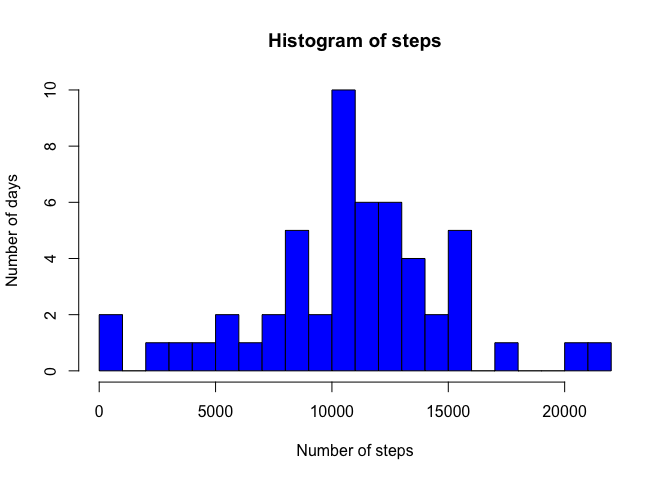
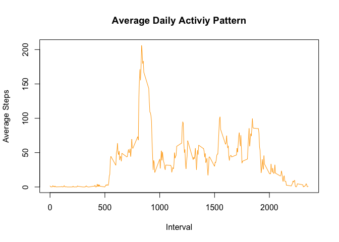
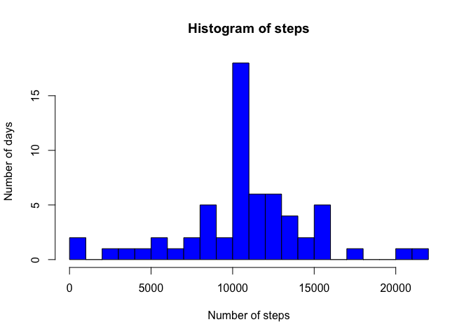
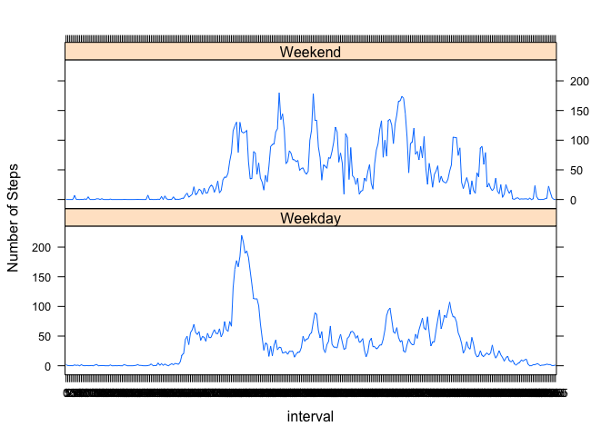

# Reproducible Research: Peer Assessment 1


## Loading and preprocessing the data
1. Loading data

```r
data = read.csv("activity.csv",header = T, sep = ",")
```
2. Taking a look to the dataset

```r
str(data)
```

```
## 'data.frame':	17568 obs. of  3 variables:
##  $ steps   : int  NA NA NA NA NA NA NA NA NA NA ...
##  $ date    : Factor w/ 61 levels "2012-10-01","2012-10-02",..: 1 1 1 1 1 1 1 1 1 1 ...
##  $ interval: int  0 5 10 15 20 25 30 35 40 45 ...
```

```r
summary(data)
```

```
##      steps                date          interval     
##  Min.   :  0.00   2012-10-01:  288   Min.   :   0.0  
##  1st Qu.:  0.00   2012-10-02:  288   1st Qu.: 588.8  
##  Median :  0.00   2012-10-03:  288   Median :1177.5  
##  Mean   : 37.38   2012-10-04:  288   Mean   :1177.5  
##  3rd Qu.: 12.00   2012-10-05:  288   3rd Qu.:1766.2  
##  Max.   :806.00   2012-10-06:  288   Max.   :2355.0  
##  NA's   :2304     (Other)   :15840
```

```r
head(data)
```

```
##   steps       date interval
## 1    NA 2012-10-01        0
## 2    NA 2012-10-01        5
## 3    NA 2012-10-01       10
## 4    NA 2012-10-01       15
## 5    NA 2012-10-01       20
## 6    NA 2012-10-01       25
```
3. Converting the variables (date to a Date class, interval to a factor)

```r
data$date <- as.Date(data$date, format = "%Y-%m-%d")
data$interval <- factor(data$interval)
```
## What is mean total number of steps taken per day?
1.For this part of the assignment, I ignore missing values as the execise said.

```r
NA_values <- is.na(as.character(data$steps))
data_no_NA <- data[!NA_values,]
```
2. Calculate the total number of steps taken per day

```r
steps_each_day <- aggregate(steps ~ date, data = data_no_NA, sum)
colnames(steps_each_day) <- c("date", "steps")
steps_each_day
```

```
##          date steps
## 1  2012-10-02   126
## 2  2012-10-03 11352
## 3  2012-10-04 12116
## 4  2012-10-05 13294
## 5  2012-10-06 15420
## 6  2012-10-07 11015
## 7  2012-10-09 12811
## 8  2012-10-10  9900
## 9  2012-10-11 10304
## 10 2012-10-12 17382
## 11 2012-10-13 12426
## 12 2012-10-14 15098
## 13 2012-10-15 10139
## 14 2012-10-16 15084
## 15 2012-10-17 13452
## 16 2012-10-18 10056
## 17 2012-10-19 11829
## 18 2012-10-20 10395
## 19 2012-10-21  8821
## 20 2012-10-22 13460
## 21 2012-10-23  8918
## 22 2012-10-24  8355
## 23 2012-10-25  2492
## 24 2012-10-26  6778
## 25 2012-10-27 10119
## 26 2012-10-28 11458
## 27 2012-10-29  5018
## 28 2012-10-30  9819
## 29 2012-10-31 15414
## 30 2012-11-02 10600
## 31 2012-11-03 10571
## 32 2012-11-05 10439
## 33 2012-11-06  8334
## 34 2012-11-07 12883
## 35 2012-11-08  3219
## 36 2012-11-11 12608
## 37 2012-11-12 10765
## 38 2012-11-13  7336
## 39 2012-11-15    41
## 40 2012-11-16  5441
## 41 2012-11-17 14339
## 42 2012-11-18 15110
## 43 2012-11-19  8841
## 44 2012-11-20  4472
## 45 2012-11-21 12787
## 46 2012-11-22 20427
## 47 2012-11-23 21194
## 48 2012-11-24 14478
## 49 2012-11-25 11834
## 50 2012-11-26 11162
## 51 2012-11-27 13646
## 52 2012-11-28 10183
## 53 2012-11-29  7047
```
3. Making a histogram

```r
hist(steps_each_day$steps, breaks=25, col ="blue",xlab="Number of steps", ylab="Number of days",main="Histogram of steps")
```

 

4. Calculate and report the mean and median of the total number of steps taken per day

```r
mean(steps_each_day$steps)
```

```
## [1] 10766.19
```

```r
median(steps_each_day$steps)
```

```
## [1] 10765
```
## What is the average daily activity pattern?
1.Making a time series plot of the 5 minute interval and the average number of steps taken

```r
steps_each_interval <- aggregate(steps ~ interval, data = data_no_NA, mean)
colnames(steps_each_day) <- c("interval", "steps")
plot(as.integer(levels(steps_each_interval$interval)),steps_each_interval$steps, type = "l", xlab ="Interval", ylab=
         "Average Steps",main="Average Daily Activiy Pattern",col="orange")
```

 

2.Which 5-minute interval, on average across all the days in the dataset, contains the 
maximum number of steps?

```r
max_steps <- max(steps_each_interval$steps)
max_steps_intervale <-steps_each_interval[which.max(steps_each_interval$steps),]$interval
max_steps_intervale
```

```
## [1] 835
## 288 Levels: 0 5 10 15 20 25 30 35 40 45 50 55 100 105 110 115 120 ... 2355
```

```r
max_steps
```

```
## [1] 206.1698
```
## Imputing missing values
1.Calculate and report the total number of missing values in the dataset

```r
sum(is.na(as.character(data$steps)))
```

```
## [1] 2304
```

```r
sum(is.na(as.character(data$date)))
```

```
## [1] 0
```

```r
sum(is.na(as.character(data$interval)))
```

```
## [1] 0
```
Thus, the total number of missing values is 2304

2. Devise a strategy to filling in all of the missing values in the dataset. In my case, the mean for that 5-minute interval. And create a new dataset that is equal to the original dataset but with the missing data filled in.

```r
NA_values <- which(is.na(as.character(data$steps)))
data_without_missing <- data
data_without_missing[NA_values, ]$steps<-unlist(lapply(NA_values, FUN=function(NA_values){
    steps_each_interval[data[NA_values,]$interval==steps_each_interval$interval,]$steps
}))
```
3. Taking a look to the new dataset

```r
summary(data_without_missing)
```

```
##      steps             date               interval    
##  Min.   :  0.00   Min.   :2012-10-01   0      :   61  
##  1st Qu.:  0.00   1st Qu.:2012-10-16   5      :   61  
##  Median :  0.00   Median :2012-10-31   10     :   61  
##  Mean   : 37.38   Mean   :2012-10-31   15     :   61  
##  3rd Qu.: 27.00   3rd Qu.:2012-11-15   20     :   61  
##  Max.   :806.00   Max.   :2012-11-30   25     :   61  
##                                        (Other):17202
```

```r
str(data_without_missing)
```

```
## 'data.frame':	17568 obs. of  3 variables:
##  $ steps   : num  1.717 0.3396 0.1321 0.1509 0.0755 ...
##  $ date    : Date, format: "2012-10-01" "2012-10-01" ...
##  $ interval: Factor w/ 288 levels "0","5","10","15",..: 1 2 3 4 5 6 7 8 9 10 ...
```
4. Making a histogram

```r
steps_each_day_without_missing <- aggregate(steps ~ date, data = data_without_missing, sum)
colnames(steps_each_day) <- c("date", "steps")
hist(steps_each_day_without_missing$steps, breaks=25, col ="blue",xlab="Number of steps", ylab="Number of days",main="Histogram of steps")
```

 

4. Calculate and report the mean and median of the total number of steps taken per day with the
new dataset

```r
mean(steps_each_day_without_missing$steps)
```

```
## [1] 10766.19
```

```r
median(steps_each_day_without_missing$steps)
```

```
## [1] 10766.19
```
## Are there differences in activity patterns between weekdays and weekends?
1. Using the dataset with the filled-in missing values for this part
2. Creating a factor variable "day "to store the day of the week:

```r
data_without_missing$day <- as.factor(weekdays(data_without_missing$date))
```
3.Creating a logical variable "is_weekday" (weekday=TRUE, weekend = FALE) :

```r
data_without_missing$is_weekday <- ifelse(!(data_without_missing$day %in% c("sabado","domingo")), TRUE, FALSE) 
```
4.Calculating the average number of steps for weekdays

```r
weekdays_data <- data_without_missing[data_without_missing$is_weekday,]
steps_per_interval_weekdays <- aggregate(weekdays_data$steps, by=list(interval=weekdays_data$interval), FUN=mean)
```
5.Calculating the average number of steps for weekends

```r
weekends_data <- data_without_missing[!data_without_missing$is_weekday,]
steps_per_interval_weekends <- aggregate(weekends_data$steps, by=list(interval=weekends_data$interval), FUN=mean)
```
6.Adding columns names

```r
colnames(steps_per_interval_weekdays) <- c("interval", "average_steps")
colnames(steps_per_interval_weekends) <- c("interval", "average_steps")
```
7.Adding a column to indecate the day

```r
steps_per_interval_weekdays$day <- "Weekday"
steps_per_interval_weekends$day <- "Weekend"
```
8.Merging the two togather

```r
week_data <- rbind(steps_per_interval_weekends, steps_per_interval_weekdays)
```
9.Converting the day variabke to a factor

```r
week_data$day <- as.factor(week_data$day)
```
10. Making the plot

```r
library(lattice)
xyplot(average_steps ~  interval | day, data = week_data, layout = c(1,2), type ="l", ylab="Number of Steps")
```

 
